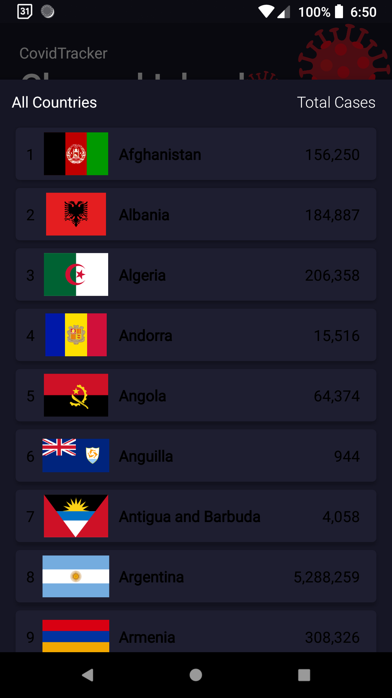

# Covid Tracker App

In this project i created a android application that shows the following details (about the selected country):
* Number of active cases 
* Number of total cases 
* Number of death recorded 
* Number of people recovered.
* Total number of tests done 

I created this app by thinking that we do not need to google everytime to know about covid related data about a particular country just open this app

# Have a look at my App layout

 

 

